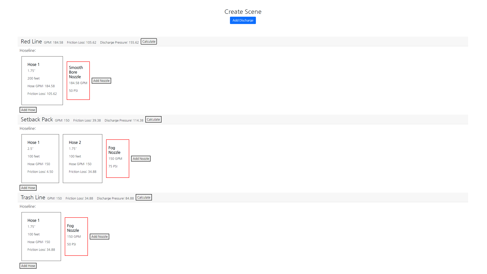
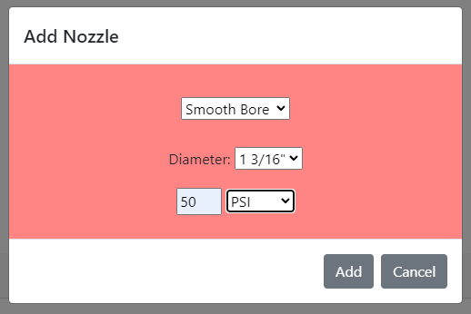

<h1>Pump App Read-Me</h1>
This app is intended for use by firefighters working on learning pump calculations and pump theory. The program allows for the user to add multiple discharges, hoses, and nozzles, with choices of diameter, nozzle type, and lengths.

The program uses pump coefficients and equations used from IFSTA and will automatically input the answers once all nozzles have been placed.

You are able to choose between smooth bore and fog. Smooth bore gives you the option to use either GPM or PSI at the nozzle and will convert the other value based off of the Smooth Bore GPM calculation.

Equations:
 
Friction Loss: FL = CQL
 
Smooth Bore GPM: 29.7 * D^2 * sqrt(np)
 
Smooth Bore PSI: ((GPM/29.7)/d^2)^2
 
Key:  
C = Coefficient (provided by IFSTA)  
FL = Friction Loss  
Q = Quantity (GPM)  
L = Length (Feet)  
D = Diameter (inches) of hose  
d = Diameter (inches) of nozzle bore  
PSI = Pounds per Square Inch (at nozzle)  

<h2>Getting Started</h2>
 
Initially, the screen should only show a "Create Scene" header with an "Add Discharge" button. On a fire scene, there can be many different hoses running off of a single engine, all with unique tasks their working on. For a basic scenario, we will have a 200' line with a 1 3/4" diameter running to a smooth bore nozzle. Our target GPM will be 185 GPM.
 
To start, click "Add Discharge". A window will pop up, asking for a discharge name. In this example, you can just add "Attack Line".
 
Click "Create" and your new discharge will show up on the screen. From here, you have the option to add a nozzle or a hoseline. Nozzles and hoselines can be added in any order. We will start by adding our hose first.
 
Select "Add Hose" and in this window, you're able to choose between 2.5" and 1.75" diameter hose as well as any length you want. Fire hose is usually made in 50' or 100' sections. For our attack line, let's choose to add 200' and click "Add".
 
Now that we have our hose, select "Add Nozzle". On this window, we can choose to either add a fog nozzle or a smooth bore nozzle. Fire departments have different nozzle types for all different situations. New firefighters are expected to learn and memorize each and every nozzle name, the desired PSI at the nozzle, and the expected GPM. Smooth Bore nozzles have a seperate equation to calculate the relationship between the nozzle bore diameter and PSI to GPM.
 
For this example, let's choose "Smooth Bore" for the nozzle type, 15/16" for diameter, and 50 PSI as the final selection. Click "Add" to set your nozzle.
 
Once added, the program will calculate the GPM that the nozzle will produce at this PSI. In this case, it would be 184.58 GPM. On the fireground, driver operators and engineers don't worry too much about decimal points, but in the classroom, it's important to stay as precise as possible. 
 
Now we have our Attack Line set up. All that's left to do is select "Calculate" in our top line next to the attack line parameters. 
 
The program will calculate the total GPM from this discharge (when multiple nozzles are added, the total GPMs from each nozzle will be added together for this number), the total friction loss from the hoses, and what your pump discharge pressure should be set at, which is based off of friction loss and your nozzle pressures. The more nozzles and hoses taht are added, the more complex a scene will get for the pumper.

Hopefully you enjoyed this, even if it might not fully make sense for you. If you have any questions or want to know more, please contact me!
